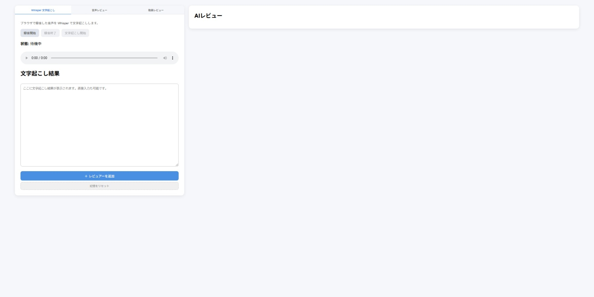
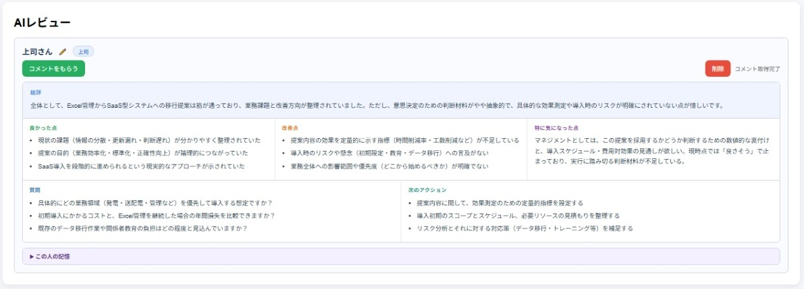
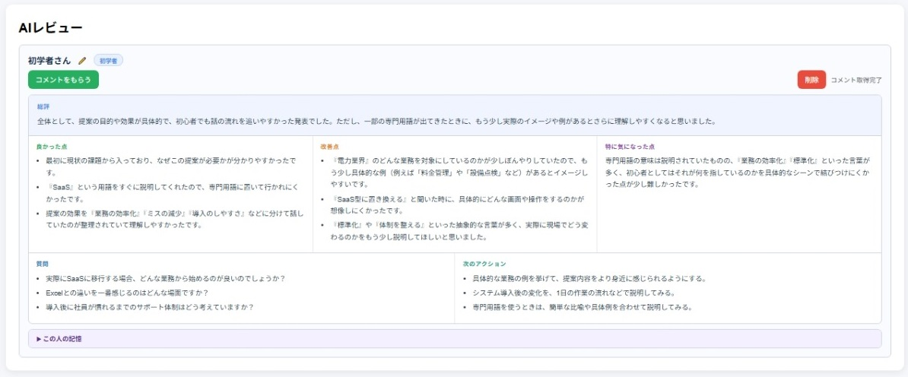
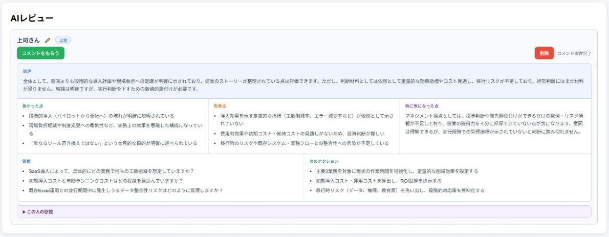

# 「発表ヘタだな…」を解決したくてAIに役割を演じさせる発表練習アプリを作った話

## はじめに

突然ですが、**発表練習の相手って困りませんか？**

「明日プレゼンあるけど誰かに聞いてもらいたい」「上司目線のフィードバックが欲しいけど毎回頼みにくい」——そういう場面、わりとありますよね。

そこで今回は **Whisper（音声認識） + Azure OpenAI（LLM）+ FastAPI** を組み合わせて、**AIに複数の役割を演じさせる発表練習Webアプリ** を作ってみました。

この記事では、作った経緯・構成・実装のポイントを紹介します。

---

## 作ったもの

ひとことで言うと、**「発表を録音 → 自動文字起こし → AIが複数の立場からフィードバック」** ができるWebアプリです。

**主な機能**

- ブラウザで録音、または音声/動画ファイルをアップロード
- OpenAI Whisper で日本語に自動文字起こし
- Azure OpenAI（GPT）で文章を自然に校正
- 複数のAIレビュアーが、それぞれの立場でフィードバックを生成
- フィードバック履歴をCSVに蓄積し、2回目以降は「前回の傾向」を踏まえたコメントを返す
- 動画アップロード時はスライド切替を検出して、スライドごとの発言も確認できる

**AIレビュアーのラインナップ**

| カテゴリ | レビュアー |
|---|---|
| 職場系 | 大学教授、上司、同僚、初学者 |
| 開発系 | 開発者（コードレビュー視点）、PM、PO |
| 日常系 | 友人 |


*録音ボタン・レビュアー選択・フィードバック表示エリアを備えたメイン画面*

---

## 技術スタック

```
フロントエンド  : HTML + JavaScript（最小構成）
バックエンド    : Python / FastAPI
音声認識        : OpenAI Whisper（ローカル実行・smallモデル）
テキスト生成    : Azure OpenAI（GPT）
動画処理        : ffmpeg + OpenCV
データ保存      : CSVファイル（DBなし）
```

DBを使わずCSVで完結させているのは、PoC段階で環境構築コストを下げたかったからです。

---

## アーキテクチャ

```
[ブラウザ]
  ↓ 音声録音 or 動画アップロード
[FastAPI]
  ↓ 音声ファイル受信
[Whisper]（ローカル）
  ↓ 日本語テキスト
[Azure OpenAI]
  ↓ テキスト校正（ノイズ・フィラー除去）
  ↓ 役割別フィードバック生成（JSON形式）
[history_store.py]
  ↓ CSVに履歴保存 → プロファイル自動更新
[ブラウザ]
  ← フィードバック表示
```

---

## 実装のポイント

### 1. Whisperの遅延ロード

Whisperはモデルのロードに数秒かかります。そこで **初回リクエスト時にロードする遅延ロード** にしました。ダブルチェックロッキングを使ってスレッドセーフにしています。

```python
_whisper_model = None
_whisper_model_lock = threading.Lock()

def get_model() -> whisper.Whisper:
    global _whisper_model
    if _whisper_model is None:
        with _whisper_model_lock:
            if _whisper_model is None:  # ダブルチェックロッキング
                _whisper_model = whisper.load_model("small")
    return _whisper_model
```

### 2. 文字起こし後にAIで校正する理由

Whisperで文字起こしした後、そのままレビューに回すのではなく、**Azure OpenAI を使って一度テキストを校正**しています。

```python
raw_text     = result.get("text", "").strip()   # Whisper の生テキスト
refined_text = brushup_text(raw_text)            # AI 校正済みテキスト
```

校正プロンプトの内容はこんな感じです。

```
内容の意味は変えず、言っていない情報を補わず、日本語として自然で読みやすい文章に校正してください。

制約:
- 意味を変えない / 事実を追加しない / 要約しない
- フィラー語（えー、あのー、えっと等）は必要に応じて除去する
- 話し言葉を、発表文として自然な文に整える
- 校正後の本文のみを出力する
```

**なぜ校正が必要か**

実際の発表では「えー」「あのー」といったフィラー語や、詰まった部分での繰り返しが入ります。これを校正せずにそのままレビューに渡すと、AIが「フィラー語が多い」「同じ言葉を繰り返している」といった話し方の癖に反応してしまいます。

本来フィードバックしてほしいのは発表の **構成・論理展開・言葉の選び方** といった中身の部分です。フィラー語への言及がそこに混ざると、肝心な指摘が埋もれてしまいます。

そのため、まずAIで「発表として読める文章」に整えてからレビューに渡す、という構成にしました。

実際にどの程度変わるかというと、たとえばこんな感じです。

**校正前（Whisperの生出力）**

<div style="background: #f9fafb; border: 1px solid #cbd5e0; border-radius: 8px; padding: 24px; margin: 16px 0;">
現在 遺伝力業界では 多くの業務がエクセルで管理されていますしかし 担当者ごとにファイルが置かれたり 更新モレや入力ミスが起きたりして必要な情報をすぐに確認できない場面が少なくありませんこうした状況では 確認作業に時間がかかり 判断の遅れにもつながりますそこで提案したいのが Excel中心の管理をサース型のアプリケーションに置き換えことですまずは インターネット系で利用できる業務システムのことで特別な機会を自社でもおたなくても 使い始められる仕組みのことですこの形にすることで 複数のエクセルファイルに書かれていた情報を1つにまとめ関係者が同じ画面でも同じ情報を確認できるようなことが上げられますこれにより まず業務の効率化がメリットして上げられますこれまで人手で行っていた確認や集計の時間を減らし 作業時間を大きく短縮できますまた 最新情報がすぐに共有されるため 状況の変化にも素材を具体的できますさらに 入力有用や確認流れをシステムに合わせて統一することでミスや担当者任せの運用を減らせます導入の支扱も大きな特徴ですさあ 姿であれば 大きな初期統称せずに始めやすく必要な範囲から少しずつ広げることもできます制度変更や業務の変化があっても システムを更新しやすいため長く使いやすい仕組みできますつまり 本提案のポイントとしましては単にエクセルを別の画面に置き換える ということではありません情報をまとめ 共有しやすくし 業務を標準化することで現場の負担を減らしながらより正確に動ける体制を作るということです電力業界のこれからを考えたとき さすがは現実的で一番効果の大きい一歩であると考えています
</div>

**校正後（AIが自然な文章に整えた出力）**

<div style="background: #f9fafb; border: 1px solid #cbd5e0; border-radius: 8px; padding: 24px; margin: 16px 0;">
現在、電力業界では多くの業務がExcelで管理されています。しかし、担当者ごとにファイルが分散していたり、更新漏れや入力ミスが発生したりして、必要な情報をすぐに確認できない場面が少なくありません。こうした状況では、確認作業に時間がかかり、判断の遅れにもつながります。  
<br><br>
そこで提案したいのが、Excel中心の管理をSaaS型のアプリケーションに置き換えることです。SaaSとは、インターネット経由で利用できる業務システムのことで、特別な機器を自社で用意しなくても使い始められる仕組みを指します。  
<br><br>
この形にすることで、複数のExcelファイルに分かれていた情報を一元化し、関係者が同じ画面で同じ情報を確認できるようになります。これにより、まず業務の効率化が大きなメリットとして挙げられます。これまで人手で行っていた確認や集計の時間を減らし、作業時間を大幅に短縮できます。また、最新情報がすぐに共有されるため、状況の変化にも素早く対応することができます。さらに、入力方法や確認の流れをシステムに合わせて統一することで、ミスや担当者任せの運用を減らすことができます。  
<br><br>
導入のしやすさも大きな特徴です。SaaS型であれば、大きな初期投資をせずに始めることができ、必要な範囲から少しずつ広げることも可能です。制度変更や業務の変化があっても、システムを更新しやすいため、長く使いやすい仕組みを維持できます。  
<br><br>
つまり、本提案のポイントは、単にExcelを別のツールに置き換えるということではありません。情報をまとめて共有しやすくし、業務を標準化することで、現場の負担を減らしながら、より正確に動ける体制を整えるということです。電力業界のこれからを考えたとき、これは現実的で最も効果の大きい一歩であると考えています。
</div>

句読点の補完、誤認識された語句の修正（「遺伝力」→「電力」、「サース」→「SaaS」など）、段落構成の整理——これだけ変わります。この状態でレビューに渡すことで、AIは発表の内容そのものに集中してフィードバックを返せるようになります。

ただし裏を返すと、**レビューされているのは生の発表そのものではなく、校正済みのテキスト**です。話し方のリズムや間のとり方、フィラー語の多さといった「音声として聞いたときの印象」は評価対象から外れていることは意識しておく必要があります。

### 3. プロンプトでAIに人格を持たせる

このアプリの核心部分です。バックエンドで呼び出しているモデルは1種類（Azure OpenAI の GPT）ですが、プロンプトを切り替えることで、**まったく異なる人格を持つ複数のAIレビュアー** として振る舞わせています。

役割プロンプトは辞書で管理していて、呼び出し時にレビュアーの役割キーから対応するプロンプトを取り出します。

```python
ROLE_DICT = {
    "professor": PROFESSOR,   # 大学教授
    "superior":  SUPERIOR,    # 上司
    "colleague": COLLEAGUE,   # 同僚
    "beginner":  BEGINNER,    # 初学者
    "developer": DEVELOPER,   # 開発者
    "pm":        PROJECT_MANAGER,
    ...
}
```

さらに、コメント生成の際は **レビュアーの名前をプロンプトの先頭に注入** しています。これにより、同じ「上司」ロールでも「田中さん」と「鈴木さん」では異なる名前の人格として振る舞わせることができます。

```python
name_prefix  = f"あなたの名前は「{reviewer_name}」です。この名前の人格として振る舞ってください。\n\n"
base_prompt  = ROLE_DICT[role_type].format(transcript=transcript)
cast_message = name_prefix + profile_context + base_prompt
```

**役割プロンプトの設計**

同じ発表テキストを渡しても、役割によって出力の視点がまったく変わります。たとえば「上司」と「初学者」では、着目する観点が正反対になるよう設計しています。

```
【上司ロール】
マネジメントや意思決定の立場から評価してください。
特に以下を重視してください。
- 結論が明確か
- 実行に必要なアクションが分かるか
- 判断材料として不足している情報がないか
特に「結論が明確か」「判断材料として十分か」を優先して評価してください。

【初学者ロール】
専門知識があまりない人の立場で、発表が理解しやすいかを評価してください。
特に以下を重視してください。
- 難しい言葉が多すぎないか
- 用語の説明が十分か
- どこで分からなくなったか
特に「専門知識がない人でもついていけるか」を優先して評価してください。
```

同じ発表でも「上司は結論が明確で判断しやすい」「初学者には専門用語が多くて分かりにくい」という、一見矛盾するフィードバックが同時に得られるのが面白いところです。


*上司ロールのフィードバック：結論の明確さや判断材料の過不足を中心に指摘*


*初学者ロールのフィードバック：専門用語の多さや説明不足の箇所を中心に指摘*

プロンプト設計で効いたのは **「特に〇〇を優先して評価してください」という一文を末尾に置く** ことです。これだけで出力の一貫性がかなり上がりました。評価観点の列挙だけでは、モデルが毎回どの観点を優先するかが揺れやすく、役割としての個性が薄れてしまいます。優先事項を明示することで、その役割ならではのフィードバックが安定して出るようになりました。

### 4. フィードバックはJSON形式で統一

LLMにはJSON形式で出力させています。FastAPIの `response_format={"type": "json_object"}` を使うとパースエラーがほぼ出なくなります。

```python
response = client.chat.completions.create(
    model=MODEL_NAME,
    messages=[{"role": "user", "content": cast_message}],
    response_format={"type": "json_object"},  # JSONモード指定
)
result_dict = json.loads(response.choices[0].message.content.strip())
```

出力の構造はすべてのレビュアーで統一しています。

```json
{
  "summary": "総評",
  "good_points": ["良かった点1", "良かった点2"],
  "improvement_points": ["改善点1", "改善点2"],
  "role_specific_concern": "この役割として特に気になった点",
  "questions": ["質問1", "質問2"],
  "next_actions": ["次のアクション1", "次のアクション2"]
}
```

### 5. 人格ごとに独立した記憶を持たせる

1回きりのフィードバックで終わらせず、**「前回も同じこと言われた」「今回は改善されてる」** というコメントができるようにしました。

ここで重要なのが、**記憶はレビュアー（人格）単位で独立して管理されている** という点です。「上司・田中さん」の履歴と「同僚・鈴木さん」の履歴は別々に蓄積され、それぞれのプロファイルとして管理されます。同じモデルを使っていても、各レビュアーが自分自身の過去の発言傾向を持った独立した存在として機能するよう設計しています。

フィードバックのたびにCSVに履歴を保存し、直近5件からルールベースでプロファイルを自動生成します。

```
直近5件のフィードバックから...（レビュアーIDで絞り込み）
- 繰り返し出ている改善点  → recurring_issues（繰り返し指摘）
- よく褒められている点    → strengths（強み）
- 頻出の弱点             → weaknesses
- 最新で改善された点      → improved_points
```

そしてこのプロファイルを次回のプロンプトに注入します。

```python
def build_profile_context(profile: dict) -> str:
    lines = ["【あなた自身の過去のレビュー傾向（参考情報）】"]
    if recurring:
        lines.append(f"- 繰り返し指摘してきた点: {', '.join(recurring[:3])}")
    if improved:
        lines.append(f"- 前回から改善が見られた点: {', '.join(improved[:3])}")
    ...
    lines += [
        "今回の評価では、以下にも注目してください。",
        "- 前回より改善した点",
        "- まだ繰り返されている課題",
        "- 今回新たに見つかった課題",
    ]
    return "\n".join(lines)
```

これにより「前回も導入が長いと指摘しましたが、今回もやや長めです」といったコメントが出るようになります。単なる「AI」ではなく、**自分の発言の履歴を持ち、それを踏まえて話す個別の存在** として機能するのが狙いです。


*「前回よりも〜点は評価できます」「依然として〜」など、過去の履歴を踏まえたコメントが出力されている様子*

### 6. 表現ゆれの正規化

フィードバックの集計をするとき、「結論が遅い」「最初に結論がない」「結論提示が遅い」はすべて同じことを指しています。これを統一しないとプロファイルの精度が下がります。

```python
NORMALIZATION_MAP = {
    "結論が遅い":       "結論提示が遅い",
    "結論提示が遅い":   "結論提示が遅い",
    "最初に結論がない": "結論提示が遅い",
    "導入が長い":       "導入が長い",
    "前置きが長い":     "導入が長い",
    "専門用語が多い":   "専門用語の説明不足",
    ...
}
```

LLMの出力にはある程度ゆれが出るので、この正規化辞書は地味に重要でした。

### 7. スライド切替検出（動画解析）

動画をアップロードした場合、ffmpegで音声を抽出してWhisperで文字起こしするだけでなく、**OpenCVでフレーム差分を分析してスライドの切替タイミングを検出**しています。

```
動画ファイル
  ↓ ffmpeg で音声抽出
  ↓ Whisper で文字起こし（セグメント付き）
  ↓ OpenCV でフレーム差分分析 → スライド切替時刻を検出
  ↓ スライドの時間帯と発言セグメントを紐づけ
→ スライドごとの発言テキスト + サムネイル
```


*スライドのサムネイルと、そのスライド表示中に話した発言テキストが対応して並んでいる解析結果画面*
> 📸 **キャプチャ内容**：発表動画をアップロードして解析を完了させた後の画面を撮影する。スライドのサムネイル画像と、そのスライドを表示していた時間帯に話した発言テキストが対応して並んでいる状態が見えるようにする。スライドが3枚以上含まれる動画を使用すると、切替検出の様子がわかりやすい。

---

## やってみてわかったこと

**よかった点**

- プロンプトで役割・観点・優先事項を明確に指定すると、ちゃんとその役割を演じてくれる。同じモデルから「上司らしい」「初学者らしい」とはっきり異なる出力が得られた
- CSV形式で過去の指摘内容を保持しておくだけで、比較的簡単に記憶を持たせることができた。DBを使わなくても「前回も同じことを言った」というコメントが出るようになった
- AIの出力形式をJSON形式で細かく指定しておくことで出力が固定化でき、画面側で想定どおりの表示が安定して行えた。フロント実装がシンプルになったのもここが大きい

**課題**

- AIは毎回必ず指摘事項を挙げようとするため、発表内容を修正しても際限なく新たな指摘が出てくる。「もう指摘することがない」という状態にはなりにくく、改善が終わりのない作業になりやすい
- 現実のレビューでは「本番まで時間がない」という時間的制約の中で優先度をつけた指摘が求められるが、現状のAIはその文脈を持たない。結果として、重要度の低い指摘と本質的な改善点が同列に並んでしまうことがある

---

## 今後やってみたいこと

- 現在は役割ごとにプロンプトが固定されているが、作成した人格に対して「より厳しくフィードバックする」「専門用語は使わない」など、より具体的な性格・特性をユーザーが入力できるようにしたい
- 発表内容をレビューしてもらう前に、AIに対して事前知識をインプットできるようにしたい。たとえば「この発表は社内向けで聴衆は同業者」「本番まで残り1週間」といった文脈を渡すことで、より現実に即したフィードバックが得られると思っている

---

## おわりに

「発表練習の相手がほしい」という動機から作り始めたアプリですが、次の3つの問いを検証したいという気持ちがありました。

1. **プロンプトだけで、AIに明確な役割・個性を持たせることはできるか**
2. **実際には同じモデルであっても、AIを「個々の人格」として区別して扱えるか**
3. **人格ごとに独立した記憶を持たせ、一貫したキャラクターとして振る舞わせることができるか**

結果として、3つの問いに対してそれぞれ手応えを得ることができました。

- **役割の付与**: プロンプトで観点・話し方・優先事項を具体的に定義すれば、同じモデルから明確に異なる個性を引き出せる
- **人格の区別**: レビュアーをIDで管理し、名前をプロンプトに注入することで、同一モデルを複数の独立した人格として扱える
- **記憶の独立**: 履歴とプロファイルをレビュアー単位で分離することで、各人格が自分自身の発言傾向を持つ存在として機能する

一方で「その人格を深く知っている人間が見ても違和感のない再現」という部分は、まだ全然届いていません。その話はおまけのCパートに書きました。

この記事が「LLMに役割を演じさせたい」「Whisperを組み込みたい」と思っている方の参考になれば幸いです。

最後まで読んでいただきありがとうございました！

---

## Cパート：特定の個人をAIで再現したい

ここからは完全に趣味の話です。技術的な内容は以上で終わっているので、興味のない方はそっとブラウザを閉じてください。

### そもそもの動機

このアプリのテーマには、前述の通り「プロンプトでAIに個性を持たせる」「個別の人格として管理する」「人格ごとに独立した記憶を持たせる」という3つの問いがありました。その検証として、発表練習という文脈に収まる職場系・開発系のロールを作ってきたわけです。

ただ、より根底にあるテーマとして以下がありました。

**「特定の個人の性格・判断・考え方・意思決定を、AIで再現することはできるのだろうか？」**

「さくらみこならこの状況でどう反応するか」「AZKiならこの発表をどう評価するか」——そういうことが再現できたら面白いと思っていて、VTuberキャラクターの実装はその実験台でした。

### さくらみこ：まず「それっぽい外見」から作ってみた

最初に作ったのは「さくらみこ」です。特徴的な語尾と話し方を持つキャラクターなので、プロンプトで個性を表現する練習として選びました。

語尾「〜にぇ」の出現頻度のコントロールには特に苦労しました。何も指定しないと毎文末につき逆に不自然になる。かといって抑制しすぎると一切出てこない。試行錯誤の末、以下のような指定に落ち着きました。

```
語尾：「〜にぇ」「〜だにぇ」は4〜5文に1回ていどの頻度で使う（毎文の語尾につけない）
「にぇ」がない文では「ね」「じゃん」などふつうの語尾を使う
```

多少コントロールできるようにはなりましたが、実行のたびに頻度がばらつくのは解消できておらず、現状の出来には正直まだ満足していません。

### 兎田ぺこら・大空スバル：語尾の癖がある2人を追加

さくらみこで掴んだパターンをもとに、同じく特徴的な語尾と言動を持つ「兎田ぺこら」と「大空スバル」も作りました。

`兎田ぺこら` では「動詞にたまに不自然な『れ』を足す（例：『できる』→『できれる』）、本人は気づいていない」という指定を、`大空スバル` では感情の強さに応じたリアクション表現の出し分けを指定しています。

### 共通の課題：知っている人ほど違和感がある

さくらみこ・ぺこら・スバルの3人を作ってみて、実感した限界があります。

**プロンプトで再現できるのは、あくまでパブリックイメージの範囲でしかない** ということです。

公式サイトやwikiに載っているキャラクター設定、よく知られているフレーズや口癖——そういった「外側の情報」をなぞることはできます。さくらみこを知っている人が見れば、「ああ、みこちっぽいな」とは感じてもらえるかもしれません。

でも、配信やSNSで日々見られる本人の実際の言動——**物事の見方、話の展開の仕方、感情の動くポイント、とっさの反応のパターン**——そういった「その人らしさ」の核心部分は、今のプロンプトでは全然再現できていません。

結果として、**よく知っている人ほどかえって違和感が大きくなる** という逆説的な状況が生まれています。「それっぽい外見」が整っているぶん、中身とのギャップが目立つ、ということです。

より一人の人間らしい人格を再現するためには、

- ある話題に対してどう反応し、どういう順序で考えを展開するか
- 何を大事にしていて、何に対して感情が動くか
- 特定の状況での判断や言葉遣いの具体的な例

こういった情報を、限りなく具体的にプロンプトに盛り込んでいく必要があるだろう——というところまではわかりましたが、そこまで到達するのは簡単ではないと感じています。

### AZKi：「癖のないキャラクター」で別の角度から検証

最後に作ったのが「AZKi」です。

他の3人と違い、AZKi は特徴的な語尾や独特の言い回しを持たないキャラクターです。落ち着いていて理性的な会話ができるタイプなので、語尾の頻度制御のような問題は起きませんでした。音楽的な比喩を使うという特徴も、比較的素直に出力に反映されました。

ただし、やはり **パブリックイメージの再現にとどまる** という課題は同じです。

語尾の暴走がない分、表面上の違和感は少ないのですが、「AZKiという人間らしさ」の再現という観点では、さくらみこたちと同じ壁に当たっています。むしろ、個性的な語尾がないぶんだけ「何者でもないAI」に近くなってしまう、という難しさもありました。

### やってみてわかったこと

「特定の個人を再現する」という問いに対して、現時点での答えは **「外見は作れるが、中身には届かない」** です。

とはいえ、この試みを通じて **「役割定義を細かくするほど出力の一貫性が上がる」** という知見は確かに得られました。「話し方のトーン」「優先する観点」「禁止事項」「感情が動く条件」を明文化する習慣は、本編の真面目なロール（上司・教授・PM）のプロンプト設計にも直接活きています。

「特定の個人を再現したい」という問いへの挑戦は、まだ途中です。
