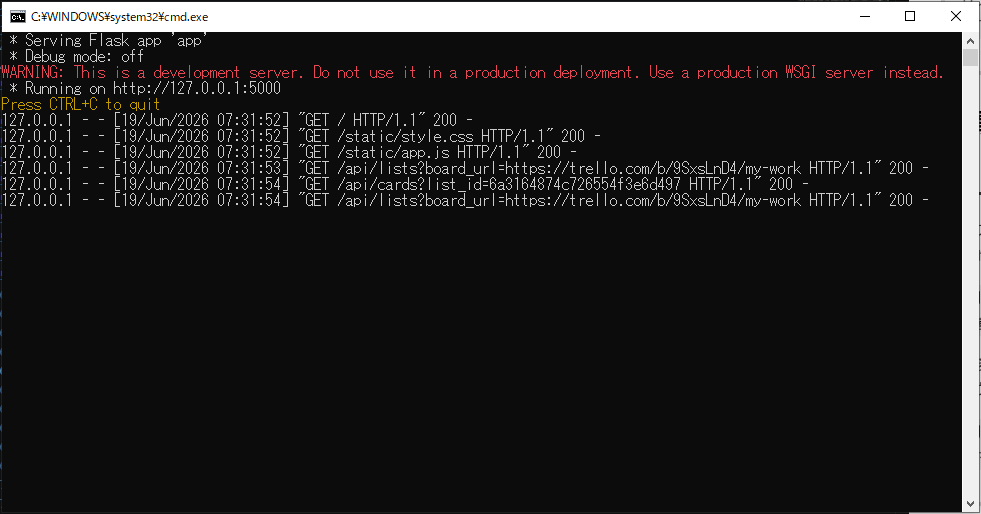
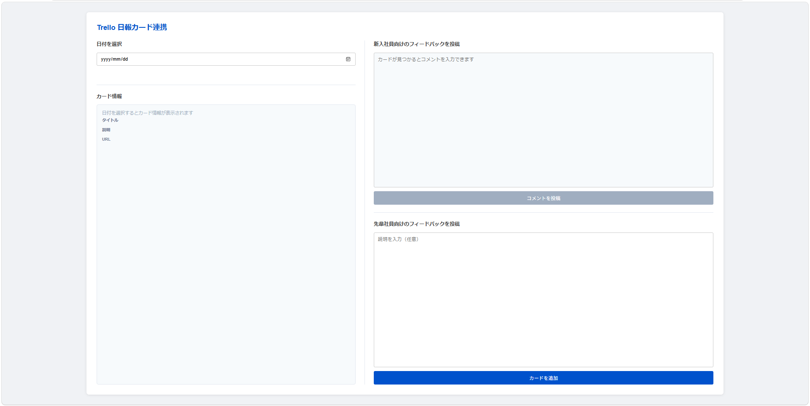
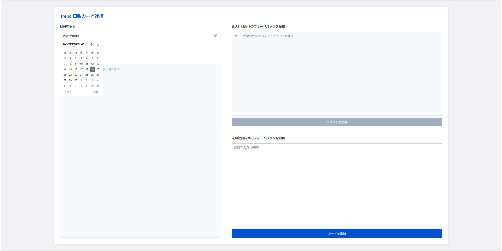
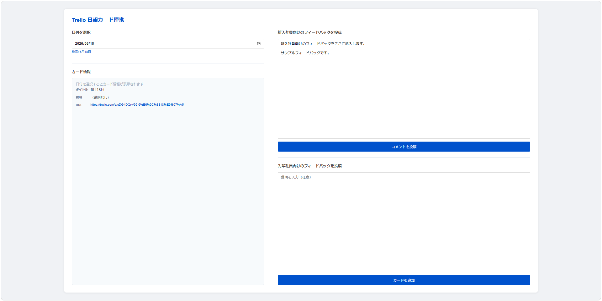
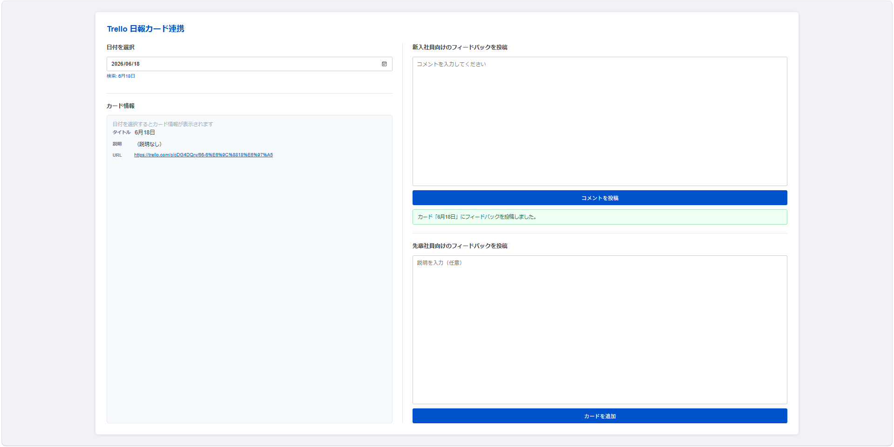
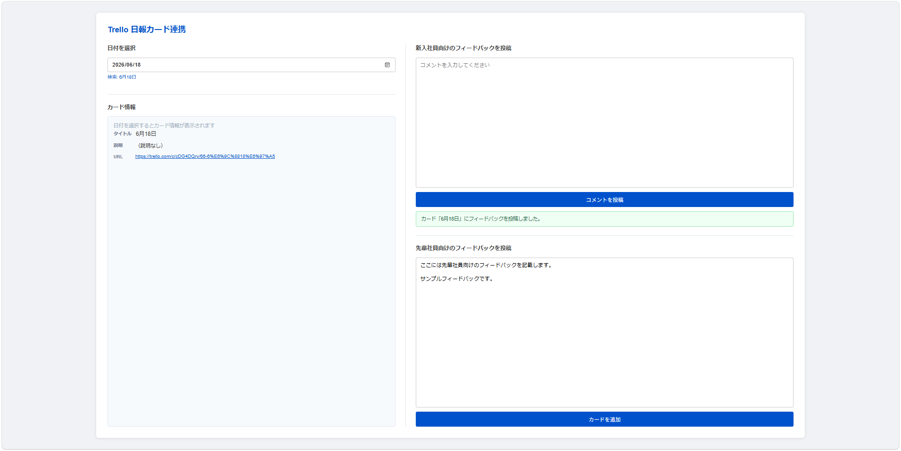
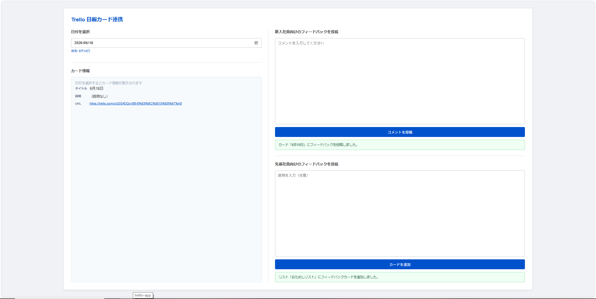

# Trello 日報カード連携　操作マニュアル

---

## 1. アプリケーション概要

本アプリケーションは、部署内研修における先輩社員・新入社員間の日報フィードバック共有を支援するツールです。  
Trello への操作（カード確認・コメント投稿・カード追加）をブラウザ上から行うことができます。

---

## 2. 配布パッケージの構成

配布用の ZIP ファイルを展開すると、以下の構成になっています。

```
trello-app/
├── trello-app.exe   # アプリケーション本体
├── 起動.bat         # 起動用バッチファイル（ダブルクリックで起動）
├── .env             # Trello API 認証情報（編集不要）
├── settings.ini     # 接続先ボード・リストの設定ファイル
└── _internal/       # 動作に必要なライブラリ群（変更・削除不可）
```

### 各ファイルの役割

| ファイル | 説明 | 編集 |
|---|---|---|
| `trello-app.exe` | アプリ本体。直接起動も可能だがブラウザは手動で開く必要がある。 | 不要 |
| `起動.bat` | exe を起動しブラウザを自動で開く。**通常はこちらを使用。** | 不要 |
| `.env` | Trello に投稿するアカウントの API キーとトークンを格納。 | 不要 |
| `settings.ini` | 参照するボード URL・リスト名を設定。月が変わりリスト名が変わった場合などに更新が必要。 | 必要に応じて |
| `_internal/` | アプリの動作に必要なファイル群。**内容を変更・削除しないでください。** | 不要 |

> **⚠ 注意**  
> `_internal/` フォルダを削除・移動するとアプリが起動しなくなります。  

### settings.ini の内容

```ini
[view]
board_url    = https://trello.com/b/xxxxxx/YWTシート   # 新入社員の日報を参照するボード
default_list = 本日のYW（やったこと・わかったこと）    # 参照するリスト名

[create]
board_url    = https://trello.com/b/yyyyyy/48期_日報   # 先輩社員向けカードを追加するボード
default_list = 7月日報                                  # 追加するリスト名
```

> リスト名が変わった場合（例：月が替わり「7月日報」→「8月日報」）は、`settings.ini` の `default_list` を更新してアプリを再起動してください。

---

## 3. 事前準備

### 3-1. アプリケーションの起動

配布フォルダ内の **`起動.bat`** をダブルクリックしてください。  
自動的にブラウザが開き、アプリケーション画面が表示されます。

> 📸 **【スクリーンショット①】**  
> `起動.bat` が格納されているフォルダの画面を貼り付けてください。

起動後、以下のようにコマンドプロンプトが立ち上がりアプリが起動します。  
このウィンドウはアプリの動作中は**閉じないでください**。



---

## 4. 画面説明



アプリケーションの画面は **左エリア** と **右エリア** の 2 列で構成されています。

| エリア | 機能 |
|---|---|
| 左：日付を選択 / カード情報 | 日付を指定して新入社員の日報カードを確認する |
| 右上：新入社員向けのフィードバックを投稿 | 日報カードにコメントを投稿する |
| 右下：先輩社員向けのフィードバックを投稿 | 先輩社員のみに共有するフィードバックカードを追加する |

---

## 5. 操作手順

### 手順 1｜日報カードを確認する

新入社員が作成した当日の日報カードを検索して内容を確認します。

1. 画面左の **「日付を選択」** エリアのカレンダーから確認したい日付をクリックします。

    

2. 選択した日付の名前が付いた日報カードが自動的に検索され、**「カード情報」** エリアに内容が表示されます。

> 📸 **【スクリーンショット⑤】**  
> カード情報エリアにタイトル・説明・URL が表示されている画面を貼り付けてください。

> **⚠ 注意**  
> 指定した日付のカードが Trello 上に存在しない場合、エラーメッセージが表示されます。  

---

### 手順 2｜新入社員向けフィードバックをコメントとして投稿する

日報カードに、新入社員も参照できるフィードバックコメントを投稿します。

> **前提：** 手順 1 でカードが正常に表示されていること

1. 画面右上の **「新入社員向けのフィードバックを投稿」** エリアのテキストボックスにフィードバック内容を入力します。

    

2. **「コメントを投稿」** ボタンをクリックします。

3. 「○○にフィードバックを投稿しました。」という緑色のメッセージが表示されれば完了です。

    

> **確認方法：** Trello で該当カードを開き、コメント欄にフィードバックが追記されていることを確認できます。

---

### 手順 3｜先輩社員向けフィードバックカードを追加する

新入社員には共有しない内容を、先輩社員専用のボードにカードとして記録します。

1. 手順 1 と同様に、画面左の **「日付を選択」** から対象の日付を選択します。  
   （すでに手順 1 で選択済みの場合は再度選択する必要はありません。）

2. 画面右下の **「先輩社員向けのフィードバックを投稿」** エリアのテキストボックスに、記録したい内容を入力します。

    

3. **「カードを追加」** ボタンをクリックします。

4. 「○○にフィードバックカードを追加しました。」という緑色のメッセージが表示されれば完了です。

    

> **確認方法：** Trello の「48期_日報」ボード → 「7月日報」リストに、選択した日付を名前とするカードが追加されます。

---

## 6. FAQ

**Q. 日付を選択してもカードが見つからないと表示される**  
A. 新入社員が該当日の日報カードをまだ作成していない可能性があります。Trello の「YWTシート」ボードを直接確認してください。カード名が「M月D日」の形式（例：`7月2日`）でない場合も検索に引っかかりません。

**Q. アプリを起動したらエラーが表示された**  
A. コマンドプロンプトのウィンドウに表示されているエラー内容を確認してください。`.env` の API キー・トークンが正しく設定されているか、インターネットに接続されているかを確認してください。

**Q. コメントの投稿者名を変更したい**  
A. 投稿者は `.env` に設定された Trello アカウントで固定されています。投稿者を変えたい場合は、`.env` を変更する必要があります。

**Q. アプリケーションを終了するには**  
A. 起動時に開いたコマンドプロンプトのウィンドウを閉じてください。ブラウザのタブは閉じるだけで構いません。
