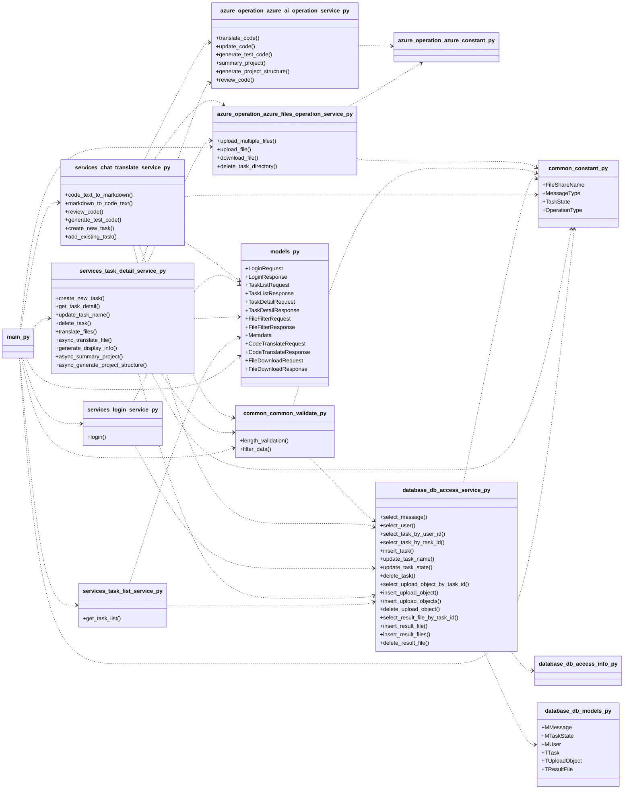

```mermaid
classDiagram
  direction LR
  class azure_operation_azure_ai_operation_service_py {
    +translate_code()
    +update_code()
    +generate_test_code()
    +summary_project()
    +generate_project_structure()
    +review_code()
  }
  class azure_operation_azure_constant_py {
  }
  class azure_operation_azure_files_operation_service_py {
    +upload_multiple_files()
    +upload_file()
    +download_file()
    +delete_task_directory()
  }
  class common_common_validate_py {
    +length_validation()
    +filter_data()
  }
  class common_constant_py {
    +FileShareName
    +MessageType
    +TaskState
    +OperationType
  }
  class database_db_access_info_py {
  }
  class database_db_access_service_py {
    +select_message()
    +select_user()
    +select_task_by_user_id()
    +select_task_by_task_id()
    +insert_task()
    +update_task_name()
    +update_task_state()
    +delete_task()
    +select_upload_object_by_task_id()
    +insert_upload_object()
    +insert_upload_objects()
    +delete_upload_object()
    +select_result_file_by_task_id()
    +insert_result_file()
    +insert_result_files()
    +delete_result_file()
  }
  class database_db_models_py {
    +MMessage
    +MTaskState
    +MUser
    +TTask
    +TUploadObject
    +TResultFile
  }
  class services_chat_translate_service_py {
    +code_text_to_markdown()
    +markdown_to_code_text()
    +review_code()
    +generate_test_code()
    +create_new_task()
    +add_existing_task()
  }
  class services_login_service_py {
    +login()
  }
  class services_task_detail_service_py {
    +create_new_task()
    +get_task_detail()
    +update_task_name()
    +delete_task()
    +translate_files()
    +async_translate_file()
    +generate_display_info()
    +async_summary_project()
    +async_generate_project_structure()
  }
  class services_task_list_service_py {
    +get_task_list()
  }
  class models_py {
    +LoginRequest
    +LoginResponse
    +TaskListRequest
    +TaskListResponse
    +TaskDetailRequest
    +TaskDetailResponse
    +FileFilterRequest
    +FileFilterResponse
    +Metadata
    +CodeTranslateRequest
    +CodeTranslateResponse
    +FileDownloadRequest
    +FileDownloadResponse
  }
  class main_py {
  }

  azure_operation_azure_ai_operation_service_py ..> azure_operation_azure_constant_py
  azure_operation_azure_files_operation_service_py ..> azure_operation_azure_constant_py
  azure_operation_azure_files_operation_service_py ..> common_constant_py
  common_common_validate_py ..> common_constant_py
  common_common_validate_py ..> database_db_access_service_py
  database_db_access_service_py ..> common_constant_py
  database_db_access_service_py ..> database_db_access_info_py
  database_db_access_service_py ..> database_db_models_py
  services_chat_translate_service_py ..> azure_operation_azure_ai_operation_service_py
  services_chat_translate_service_py ..> azure_operation_azure_files_operation_service_py
  services_chat_translate_service_py ..> common_common_validate_py
  services_chat_translate_service_py ..> common_constant_py
  services_chat_translate_service_py ..> database_db_access_service_py
  services_chat_translate_service_py ..> models_py
  services_login_service_py ..> database_db_access_service_py
  services_login_service_py ..> models_py
  services_task_detail_service_py ..> azure_operation_azure_ai_operation_service_py
  services_task_detail_service_py ..> azure_operation_azure_files_operation_service_py
  services_task_detail_service_py ..> common_common_validate_py
  services_task_detail_service_py ..> common_constant_py
  services_task_detail_service_py ..> database_db_access_service_py
  services_task_detail_service_py ..> models_py
  services_task_list_service_py ..> database_db_access_service_py
  services_task_list_service_py ..> models_py
  main_py ..> azure_operation_azure_files_operation_service_py
  main_py ..> common_common_validate_py
  main_py ..> common_constant_py
  main_py ..> models_py
  main_py ..> services_chat_translate_service_py
  main_py ..> services_login_service_py
  main_py ..> services_task_detail_service_py
  main_py ..> services_task_list_service_py
```