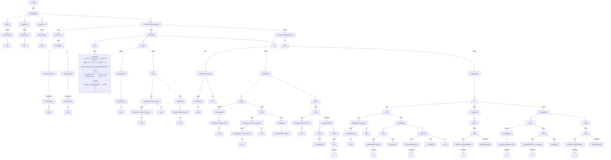

```mermaid
graph TD
  N1["Module"]
  N2["list(body)[4]"]
  N1 -- "body" --> N2
  N3["Import"]
  N2 -- "0" --> N3
  N4["list(names)[1]"]
  N3 -- "names" --> N4
  N5["alias"]
  N4 -- "0" --> N5
  N6["ImportFrom"]
  N2 -- "1" --> N6
  N7["list(names)[1]"]
  N6 -- "names" --> N7
  N8["alias"]
  N7 -- "0" --> N8
  N9["ImportFrom"]
  N2 -- "2" --> N9
  N10["list(names)[1]"]
  N9 -- "names" --> N10
  N11["alias"]
  N10 -- "0" --> N11
  N12["FunctionDef(name=login)"]
  N2 -- "3" --> N12
  N13["arguments"]
  N12 -- "args" --> N13
  N14["list(args)[2]"]
  N13 -- "args" --> N14
  N15["arg(mail_address)"]
  N14 -- "0" --> N15
  N16["Name(id=str)"]
  N15 -- "annotation" --> N16
  N17["Load"]
  N16 -- "ctx" --> N17
  N18["arg(password)"]
  N14 -- "1" --> N18
  N19["Name(id=str)"]
  N18 -- "annotation" --> N19
  N20["Load"]
  N19 -- "ctx" --> N20
  N21["list(body)[3]"]
  N12 -- "body" --> N21
  N22["Expr"]
  N21 -- "0" --> N22
  N23["Constant('\\n    メールアドレスとパスワードでログインを行う\\n    参考 : パスワードハッシュ化について\\n    https://zenn.dev/417/scraps/43f1ffbe90132c\\n\\n    Args\\n    -----------------\\n    - mail_address: str,        メールアドレス\\n    - password: str,            パスワード\\n\\n    Returns\\n    -----------------\\n    - response: LoginResponse,    レスポンス\\n\\n    ')"]
  N22 -- "value" --> N23
  N24["Assign"]
  N21 -- "1" --> N24
  N25["list(targets)[1]"]
  N24 -- "targets" --> N25
  N26["Name(id=df)"]
  N25 -- "0" --> N26
  N27["Store"]
  N26 -- "ctx" --> N27
  N28["Call()"]
  N24 -- "value" --> N28
  N29["Attribute(attr=select_user)"]
  N28 -- "func" --> N29
  N30["Name(id=db_access_service)"]
  N29 -- "value" --> N30
  N31["Load"]
  N30 -- "ctx" --> N31
  N32["Load"]
  N29 -- "ctx" --> N32
  N33["list(args)[1]"]
  N28 -- "args" --> N33
  N34["Name(id=mail_address)"]
  N33 -- "0" --> N34
  N35["Load"]
  N34 -- "ctx" --> N35
  N36["If"]
  N21 -- "2" --> N36
  N37["Attribute(attr=empty)"]
  N36 -- "test" --> N37
  N38["Name(id=df)"]
  N37 -- "value" --> N38
  N39["Load"]
  N38 -- "ctx" --> N39
  N40["Load"]
  N37 -- "ctx" --> N40
  N41["list(body)[2]"]
  N36 -- "body" --> N41
  N42["Assign"]
  N41 -- "0" --> N42
  N43["list(targets)[1]"]
  N42 -- "targets" --> N43
  N44["Name(id=message_dict)"]
  N43 -- "0" --> N44
  N45["Store"]
  N44 -- "ctx" --> N45
  N46["Call()"]
  N42 -- "value" --> N46
  N47["Attribute(attr=select_message)"]
  N46 -- "func" --> N47
  N48["Name(id=db_access_service)"]
  N47 -- "value" --> N48
  N49["Load"]
  N48 -- "ctx" --> N49
  N50["Load"]
  N47 -- "ctx" --> N50
  N51["list(args)[1]"]
  N46 -- "args" --> N51
  N52["Constant('msg-E-0001')"]
  N51 -- "0" --> N52
  N53["Return"]
  N41 -- "1" --> N53
  N54["Call()"]
  N53 -- "value" --> N54
  N55["Name(id=LoginResponse)"]
  N54 -- "func" --> N55
  N56["Load"]
  N55 -- "ctx" --> N56
  N57["list(keywords)[2]"]
  N54 -- "keywords" --> N57
  N58["keyword"]
  N57 -- "0" --> N58
  N59["Constant(200)"]
  N58 -- "value" --> N59
  N60["keyword"]
  N57 -- "1" --> N60
  N61["List"]
  N60 -- "value" --> N61
  N62["..."]
  N61 -- "truncated" --> N62
  N63["list(orelse)[1]"]
  N36 -- "orelse" --> N63
  N64["If"]
  N63 -- "0" --> N64
  N65["Call()"]
  N64 -- "test" --> N65
  N66["Attribute(attr=checkpw)"]
  N65 -- "func" --> N66
  N67["Name(id=bcrypt)"]
  N66 -- "value" --> N67
  N68["Load"]
  N67 -- "ctx" --> N68
  N69["Load"]
  N66 -- "ctx" --> N69
  N70["list(args)[2]"]
  N65 -- "args" --> N70
  N71["Call()"]
  N70 -- "0" --> N71
  N72["Attribute(attr=encode)"]
  N71 -- "func" --> N72
  N73["..."]
  N72 -- "truncated" --> N73
  N74["list(args)[1]"]
  N71 -- "args" --> N74
  N75["Subscript"]
  N70 -- "1" --> N75
  N76["Attribute(attr=values)"]
  N75 -- "value" --> N76
  N77["..."]
  N76 -- "truncated" --> N77
  N78["Constant(0)"]
  N75 -- "slice" --> N78
  N79["Load"]
  N75 -- "ctx" --> N79
  N80["list(body)[1]"]
  N64 -- "body" --> N80
  N81["Return"]
  N80 -- "0" --> N81
  N82["Call()"]
  N81 -- "value" --> N82
  N83["Name(id=LoginResponse)"]
  N82 -- "func" --> N83
  N84["..."]
  N83 -- "truncated" --> N84
  N85["list(keywords)[4]"]
  N82 -- "keywords" --> N85
  N86["list(orelse)[2]"]
  N64 -- "orelse" --> N86
  N87["Assign"]
  N86 -- "0" --> N87
  N88["list(targets)[1]"]
  N87 -- "targets" --> N88
  N89["Name(id=message_dict)"]
  N88 -- "0" --> N89
  N90["..."]
  N89 -- "truncated" --> N90
  N91["Call()"]
  N87 -- "value" --> N91
  N92["Attribute(attr=select_message)"]
  N91 -- "func" --> N92
  N93["..."]
  N92 -- "truncated" --> N93
  N94["list(args)[1]"]
  N91 -- "args" --> N94
  N95["Return"]
  N86 -- "1" --> N95
  N96["Call()"]
  N95 -- "value" --> N96
  N97["Name(id=LoginResponse)"]
  N96 -- "func" --> N97
  N98["..."]
  N97 -- "truncated" --> N98
  N99["list(keywords)[2]"]
  N96 -- "keywords" --> N99
  N100["Name(id=LoginResponse)"]
  N12 -- "returns" --> N100
  N101["Load"]
  N100 -- "ctx" --> N101
```
