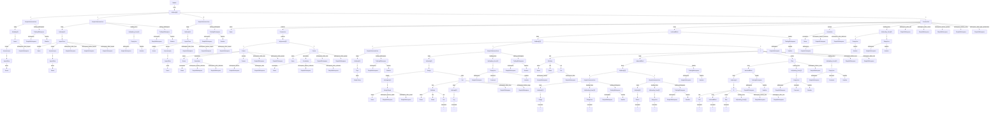

```mermaid
graph TD
  N1["Module"]
  N2["list(body)[4]"]
  N1 -- "body" --> N2
  N3["SimpleStatementLine"]
  N2 -- "0" --> N3
  N4["list(body)[1]"]
  N3 -- "body" --> N4
  N5["Import"]
  N4 -- "0" --> N5
  N6["list(names)[1]"]
  N5 -- "names" --> N6
  N7["ImportAlias"]
  N6 -- "0" --> N7
  N8["Name"]
  N7 -- "name" --> N8
  N9["SimpleWhitespace"]
  N5 -- "whitespace_after_import" --> N9
  N10["TrailingWhitespace"]
  N3 -- "trailing_whitespace" --> N10
  N11["SimpleWhitespace"]
  N10 -- "whitespace" --> N11
  N12["Newline"]
  N10 -- "newline" --> N12
  N13["SimpleStatementLine"]
  N2 -- "1" --> N13
  N14["list(body)[1]"]
  N13 -- "body" --> N14
  N15["ImportFrom"]
  N14 -- "0" --> N15
  N16["Name"]
  N15 -- "module" --> N16
  N17["list(names)[1]"]
  N15 -- "names" --> N17
  N18["ImportAlias"]
  N17 -- "0" --> N18
  N19["Name"]
  N18 -- "name" --> N19
  N20["SimpleWhitespace"]
  N15 -- "whitespace_after_from" --> N20
  N21["SimpleWhitespace"]
  N15 -- "whitespace_before_import" --> N21
  N22["SimpleWhitespace"]
  N15 -- "whitespace_after_import" --> N22
  N23["list(leading_lines)[1]"]
  N13 -- "leading_lines" --> N23
  N24["EmptyLine"]
  N23 -- "0" --> N24
  N25["SimpleWhitespace"]
  N24 -- "whitespace" --> N25
  N26["Newline"]
  N24 -- "newline" --> N26
  N27["TrailingWhitespace"]
  N13 -- "trailing_whitespace" --> N27
  N28["SimpleWhitespace"]
  N27 -- "whitespace" --> N28
  N29["Newline"]
  N27 -- "newline" --> N29
  N30["SimpleStatementLine"]
  N2 -- "2" --> N30
  N31["list(body)[1]"]
  N30 -- "body" --> N31
  N32["ImportFrom"]
  N31 -- "0" --> N32
  N33["Name"]
  N32 -- "module" --> N33
  N34["list(names)[1]"]
  N32 -- "names" --> N34
  N35["ImportAlias"]
  N34 -- "0" --> N35
  N36["Name"]
  N35 -- "name" --> N36
  N37["SimpleWhitespace"]
  N32 -- "whitespace_after_from" --> N37
  N38["SimpleWhitespace"]
  N32 -- "whitespace_before_import" --> N38
  N39["SimpleWhitespace"]
  N32 -- "whitespace_after_import" --> N39
  N40["TrailingWhitespace"]
  N30 -- "trailing_whitespace" --> N40
  N41["SimpleWhitespace"]
  N40 -- "whitespace" --> N41
  N42["Newline"]
  N40 -- "newline" --> N42
  N43["FunctionDef"]
  N2 -- "3" --> N43
  N44["Name"]
  N43 -- "name" --> N44
  N45["Parameters"]
  N43 -- "params" --> N45
  N46["list(params)[2]"]
  N45 -- "params" --> N46
  N47["Param"]
  N46 -- "0" --> N47
  N48["Name"]
  N47 -- "name" --> N48
  N49["Annotation"]
  N47 -- "annotation" --> N49
  N50["Name"]
  N49 -- "annotation" --> N50
  N51["SimpleWhitespace"]
  N49 -- "whitespace_before_indicator" --> N51
  N52["SimpleWhitespace"]
  N49 -- "whitespace_after_indicator" --> N52
  N53["Comma"]
  N47 -- "comma" --> N53
  N54["SimpleWhitespace"]
  N53 -- "whitespace_before" --> N54
  N55["SimpleWhitespace"]
  N53 -- "whitespace_after" --> N55
  N56["SimpleWhitespace"]
  N47 -- "whitespace_after_star" --> N56
  N57["SimpleWhitespace"]
  N47 -- "whitespace_after_param" --> N57
  N58["Param"]
  N46 -- "1" --> N58
  N59["Name"]
  N58 -- "name" --> N59
  N60["Annotation"]
  N58 -- "annotation" --> N60
  N61["Name"]
  N60 -- "annotation" --> N61
  N62["SimpleWhitespace"]
  N60 -- "whitespace_before_indicator" --> N62
  N63["SimpleWhitespace"]
  N60 -- "whitespace_after_indicator" --> N63
  N64["SimpleWhitespace"]
  N58 -- "whitespace_after_star" --> N64
  N65["SimpleWhitespace"]
  N58 -- "whitespace_after_param" --> N65
  N66["IndentedBlock"]
  N43 -- "body" --> N66
  N67["list(body)[3]"]
  N66 -- "body" --> N67
  N68["SimpleStatementLine"]
  N67 -- "0" --> N68
  N69["list(body)[1]"]
  N68 -- "body" --> N69
  N70["Expr"]
  N69 -- "0" --> N70
  N71["SimpleString"]
  N70 -- "value" --> N71
  N72["TrailingWhitespace"]
  N68 -- "trailing_whitespace" --> N72
  N73["SimpleWhitespace"]
  N72 -- "whitespace" --> N73
  N74["Newline"]
  N72 -- "newline" --> N74
  N75["SimpleStatementLine"]
  N67 -- "1" --> N75
  N76["list(body)[1]"]
  N75 -- "body" --> N76
  N77["Assign"]
  N76 -- "0" --> N77
  N78["list(targets)[1]"]
  N77 -- "targets" --> N78
  N79["AssignTarget"]
  N78 -- "0" --> N79
  N80["Name"]
  N79 -- "target" --> N80
  N81["SimpleWhitespace"]
  N79 -- "whitespace_before_equal" --> N81
  N82["SimpleWhitespace"]
  N79 -- "whitespace_after_equal" --> N82
  N83["Call"]
  N77 -- "value" --> N83
  N84["Attribute"]
  N83 -- "func" --> N84
  N85["Name"]
  N84 -- "value" --> N85
  N86["Name"]
  N84 -- "attr" --> N86
  N87["Dot"]
  N84 -- "dot" --> N87
  N88["..."]
  N87 -- "truncated" --> N88
  N89["list(args)[1]"]
  N83 -- "args" --> N89
  N90["Arg"]
  N89 -- "0" --> N90
  N91["..."]
  N90 -- "truncated" --> N91
  N92["SimpleWhitespace"]
  N83 -- "whitespace_after_func" --> N92
  N93["SimpleWhitespace"]
  N83 -- "whitespace_before_args" --> N93
  N94["list(leading_lines)[1]"]
  N75 -- "leading_lines" --> N94
  N95["EmptyLine"]
  N94 -- "0" --> N95
  N96["SimpleWhitespace"]
  N95 -- "whitespace" --> N96
  N97["Comment"]
  N95 -- "comment" --> N97
  N98["Newline"]
  N95 -- "newline" --> N98
  N99["TrailingWhitespace"]
  N75 -- "trailing_whitespace" --> N99
  N100["SimpleWhitespace"]
  N99 -- "whitespace" --> N100
  N101["Newline"]
  N99 -- "newline" --> N101
  N102["If"]
  N67 -- "2" --> N102
  N103["Attribute"]
  N102 -- "test" --> N103
  N104["Name"]
  N103 -- "value" --> N104
  N105["Name"]
  N103 -- "attr" --> N105
  N106["Dot"]
  N103 -- "dot" --> N106
  N107["SimpleWhitespace"]
  N106 -- "whitespace_before" --> N107
  N108["SimpleWhitespace"]
  N106 -- "whitespace_after" --> N108
  N109["IndentedBlock"]
  N102 -- "body" --> N109
  N110["list(body)[2]"]
  N109 -- "body" --> N110
  N111["SimpleStatementLine"]
  N110 -- "0" --> N111
  N112["list(body)[1]"]
  N111 -- "body" --> N112
  N113["Assign"]
  N112 -- "0" --> N113
  N114["..."]
  N113 -- "truncated" --> N114
  N115["list(leading_lines)[1]"]
  N111 -- "leading_lines" --> N115
  N116["EmptyLine"]
  N115 -- "0" --> N116
  N117["..."]
  N116 -- "truncated" --> N117
  N118["TrailingWhitespace"]
  N111 -- "trailing_whitespace" --> N118
  N119["SimpleWhitespace"]
  N118 -- "whitespace" --> N119
  N120["Newline"]
  N118 -- "newline" --> N120
  N121["SimpleStatementLine"]
  N110 -- "1" --> N121
  N122["list(body)[1]"]
  N121 -- "body" --> N122
  N123["Return"]
  N122 -- "0" --> N123
  N124["..."]
  N123 -- "truncated" --> N124
  N125["list(leading_lines)[1]"]
  N121 -- "leading_lines" --> N125
  N126["EmptyLine"]
  N125 -- "0" --> N126
  N127["..."]
  N126 -- "truncated" --> N127
  N128["TrailingWhitespace"]
  N121 -- "trailing_whitespace" --> N128
  N129["SimpleWhitespace"]
  N128 -- "whitespace" --> N129
  N130["Newline"]
  N128 -- "newline" --> N130
  N131["TrailingWhitespace"]
  N109 -- "header" --> N131
  N132["SimpleWhitespace"]
  N131 -- "whitespace" --> N132
  N133["Newline"]
  N131 -- "newline" --> N133
  N134["Else"]
  N102 -- "orelse" --> N134
  N135["IndentedBlock"]
  N134 -- "body" --> N135
  N136["list(body)[1]"]
  N135 -- "body" --> N136
  N137["If"]
  N136 -- "0" --> N137
  N138["Call"]
  N137 -- "test" --> N138
  N139["..."]
  N138 -- "truncated" --> N139
  N140["IndentedBlock"]
  N137 -- "body" --> N140
  N141["..."]
  N140 -- "truncated" --> N141
  N142["Else"]
  N137 -- "orelse" --> N142
  N143["..."]
  N142 -- "truncated" --> N143
  N144["list(leading_lines)[1]"]
  N137 -- "leading_lines" --> N144
  N145["SimpleWhitespace"]
  N137 -- "whitespace_before_test" --> N145
  N146["SimpleWhitespace"]
  N137 -- "whitespace_after_test" --> N146
  N147["TrailingWhitespace"]
  N135 -- "header" --> N147
  N148["SimpleWhitespace"]
  N147 -- "whitespace" --> N148
  N149["Newline"]
  N147 -- "newline" --> N149
  N150["list(leading_lines)[1]"]
  N134 -- "leading_lines" --> N150
  N151["EmptyLine"]
  N150 -- "0" --> N151
  N152["SimpleWhitespace"]
  N151 -- "whitespace" --> N152
  N153["Comment"]
  N151 -- "comment" --> N153
  N154["Newline"]
  N151 -- "newline" --> N154
  N155["SimpleWhitespace"]
  N134 -- "whitespace_before_colon" --> N155
  N156["list(leading_lines)[1]"]
  N102 -- "leading_lines" --> N156
  N157["EmptyLine"]
  N156 -- "0" --> N157
  N158["SimpleWhitespace"]
  N157 -- "whitespace" --> N158
  N159["Comment"]
  N157 -- "comment" --> N159
  N160["Newline"]
  N157 -- "newline" --> N160
  N161["SimpleWhitespace"]
  N102 -- "whitespace_before_test" --> N161
  N162["SimpleWhitespace"]
  N102 -- "whitespace_after_test" --> N162
  N163["TrailingWhitespace"]
  N66 -- "header" --> N163
  N164["SimpleWhitespace"]
  N163 -- "whitespace" --> N164
  N165["Newline"]
  N163 -- "newline" --> N165
  N166["Annotation"]
  N43 -- "returns" --> N166
  N167["Name"]
  N166 -- "annotation" --> N167
  N168["SimpleWhitespace"]
  N166 -- "whitespace_before_indicator" --> N168
  N169["SimpleWhitespace"]
  N166 -- "whitespace_after_indicator" --> N169
  N170["list(leading_lines)[2]"]
  N43 -- "leading_lines" --> N170
  N171["EmptyLine"]
  N170 -- "0" --> N171
  N172["SimpleWhitespace"]
  N171 -- "whitespace" --> N172
  N173["Newline"]
  N171 -- "newline" --> N173
  N174["EmptyLine"]
  N170 -- "1" --> N174
  N175["SimpleWhitespace"]
  N174 -- "whitespace" --> N175
  N176["Newline"]
  N174 -- "newline" --> N176
  N177["SimpleWhitespace"]
  N43 -- "whitespace_after_def" --> N177
  N178["SimpleWhitespace"]
  N43 -- "whitespace_after_name" --> N178
  N179["SimpleWhitespace"]
  N43 -- "whitespace_before_params" --> N179
  N180["SimpleWhitespace"]
  N43 -- "whitespace_before_colon" --> N180
  N181["SimpleWhitespace"]
  N43 -- "whitespace_after_type_parameters" --> N181
```
